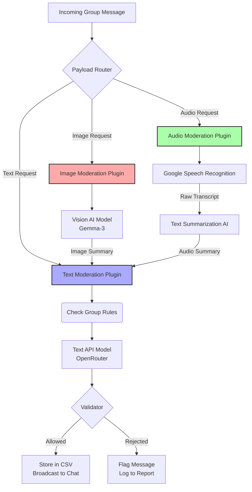

# ConvoEase - Moderation Plugin Flow

The following diagram shows how multi-modal messages (text, image, audio) flow through the central processing engine registry.

```mermaid
flowchart TD
    A[Incoming Group Message] --> B{Payload Router}
    
    B -- Text Request --> C[Text Moderation Plugin]
    B -- Image Request --> D[Image Moderation Plugin]
    B -- Audio Request --> E[Audio Moderation Plugin]
    
    C --> F(Check Group Rules)
    F --> G[Text API Model\nOpenRouter]
    G --> Z
    
    D --> H[Vision AI Model\nGemma-3]
    H --> |Image Summary| C
    
    E --> I[Google Speech Recognition]
    I --> |Raw Transcript| J[Text Summarization AI]
    J --> |Audio Summary| C
    
    Z{Validator}
    Z -- Allowed --> K[Store in CSV\nBroadcast to Chat]
    Z -- Rejected --> L[Flag Message\nLog to Report]
    
    style C fill:#aaf,stroke:#333,stroke-width:2px
    style D fill:#faa,stroke:#333,stroke-width:2px
    style E fill:#afa,stroke:#333,stroke-width:2px
```
