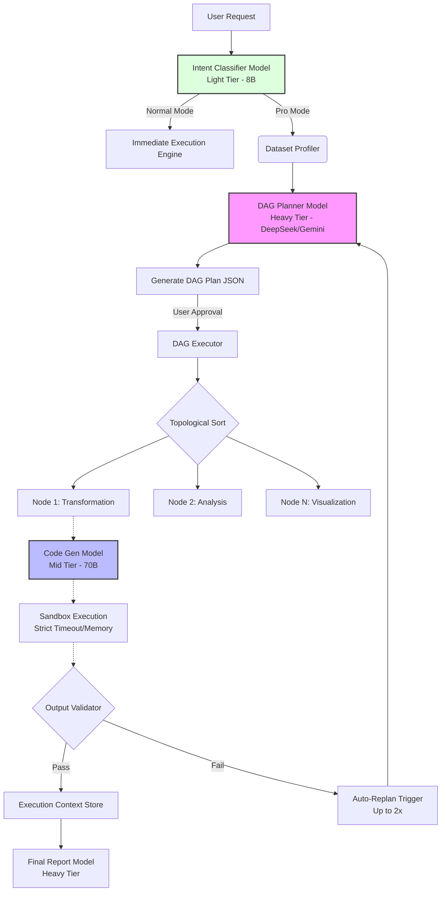

# Data Science Copilot - Execution Architecture

The following diagram illustrates the Directed Acyclic Graph (DAG) Execution flow and Model API abstraction layers in the Pro Mode pipeline.

```mermaid
flowchart TD
    A[User Request] --> B[Intent Classifier Model\nLight Tier - 8B]
    B -- Normal Mode --> C[Immediate Execution Engine]
    B -- Pro Mode --> D(Dataset Profiler)
    
    D --> E[DAG Planner Model\nHeavy Tier - DeepSeek/Gemini]
    E --> F[Generate DAG Plan JSON]
    
    F --> |User Approval| G[DAG Executor]
    G --> H{Topological Sort}
    
    H --> I[Node 1: Transformation]
    H --> J[Node 2: Analysis]
    H --> K[Node N: Visualization]
    
    I -.-> L[Code Gen Model\nMid Tier - 70B]
    L -.-> M[Sandbox Execution\nStrict Timeout/Memory]
    M -.-> N{Output Validator}
    N -- Pass --> O[Execution Context Store]
    N -- Fail --> P[Auto-Replan Trigger\nUp to 2x]
    
    P --> E
    O --> Q[Final Report Model\nHeavy Tier]
    
    style E fill:#f9f,stroke:#333,stroke-width:2px
    style L fill:#bbf,stroke:#333,stroke-width:2px
    style B fill:#dfd,stroke:#333,stroke-width:2px
```
